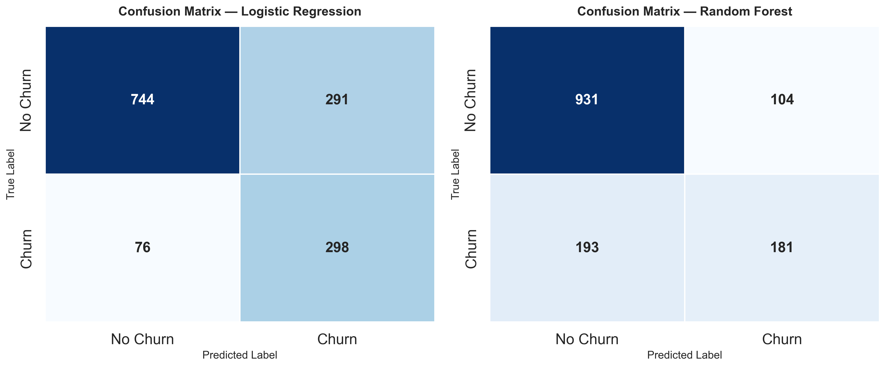
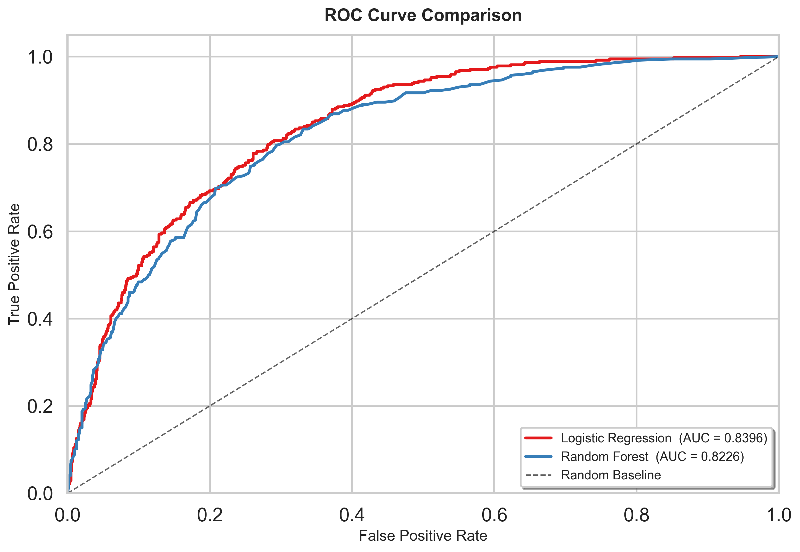
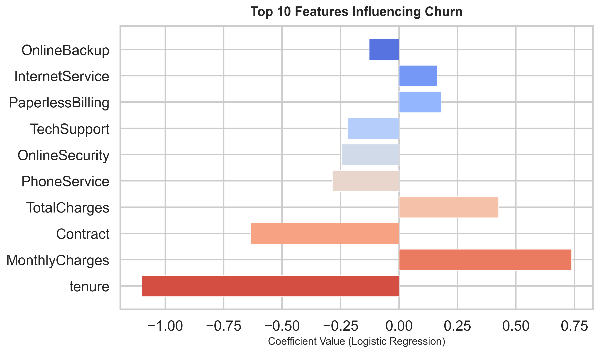

# Customer Churn Prediction Using Machine Learning

A complete, end-to-end machine learning pipeline that predicts customer churn for a telecom company. Built with **scikit-learn**, the project trains and compares two classifiers — **Logistic Regression** and **Random Forest** — and surfaces actionable business insights from model outputs.

---

## Problem Statement

Customer churn (attrition) is one of the most critical metrics for subscription-based businesses. Acquiring a new customer costs **5–7× more** than retaining an existing one. This project builds a predictive model that identifies customers likely to churn, enabling proactive retention strategies.

---

## Dataset

| Detail | Value |
|---|---|
| **Name** | Telco Customer Churn |
| **Source** | [IBM Sample Datasets](https://www.ibm.com/communities/analytics/watson-analytics/) |
| **Rows** | 7,043 |
| **Features** | 21 (demographic, account, service info) |
| **Target** | `Churn` — Yes / No |

Key columns include `tenure`, `MonthlyCharges`, `TotalCharges`, `Contract`, `InternetService`, `PaymentMethod`, and more.

---

## ML Approach

```
Raw CSV  →  Exploration  →  Cleaning & Encoding  →  Scaling  →  Train/Test Split
         →  Model Training  →  Evaluation  →  Comparison  →  Insights
```

1. **Preprocessing** — drop IDs, fix dtypes, impute missing values, label-encode categoricals, standardise features.
2. **Modelling** — train two classifiers with `class_weight='balanced'` to handle the ~27 % minority class.
3. **Evaluation** — accuracy, ROC-AUC, confusion matrix, classification report.
4. **Interpretation** — top-10 feature coefficients and business recommendations.

---

## Models Used

| # | Model | Key Hyperparameters |
|---|---|---|
| 1 | **Logistic Regression** | `max_iter=2000`, `class_weight='balanced'`, `solver='lbfgs'` |
| 2 | **Random Forest** | `n_estimators=200`, `class_weight='balanced'` |

---

## Results Summary

| Model | Accuracy | ROC-AUC |
|---|---|---|
| Logistic Regression | 0.7395 | **0.8396** |
| Random Forest | **0.7892** | 0.8226 |

> **Best model by ROC-AUC:** Logistic Regression (0.8396)

### Confusion Matrix



### ROC Curve



### Feature Importance



---

## Business Insights

1. **Contract type matters most** — month-to-month customers churn at significantly higher rates. Incentivising annual or biennial contracts can reduce attrition.
2. **Tenure is protective** — long-tenured customers rarely leave. Focus retention efforts on newcomers in their first 6–12 months.
3. **Service bundling reduces churn** — customers without online security, tech support, or online backup are more likely to leave.
4. **High monthly charges increase risk** — loyalty discounts or price-lock guarantees for premium-tier customers could help.
5. **Fiber-optic users churn more** — investigate quality-of-service and pricing satisfaction in that segment.
6. **Payment method signal** — electronic-check payers churn more; encourage auto-pay via bank transfer or credit card.

---

## How to Run

```bash
# 1. Clone the repository
git clone https://github.com/<your-username>/CustomerChurn_Project_ML.git
cd CustomerChurn_Project_ML

# 2. (Optional) Create a virtual environment
python -m venv .venv
.venv\Scripts\activate        # Windows
# source .venv/bin/activate   # macOS / Linux

# 3. Install dependencies
pip install -r requirements.txt

# 4. Run the pipeline
python churn_model.py
```

All plots and a detailed results report are saved automatically to the `outputs/` folder.

---

## Folder Structure

```
CustomerChurn_Project_ML/
│
├── data/
│   └── WA_Fn-UseC_-Telco-Customer-Churn.csv   # Raw dataset
│
├── outputs/
│   ├── confusion_matrix.png                    # Confusion matrix heatmap
│   ├── roc_curve.png                           # ROC curve comparison
│   ├── feature_importance.png                  # Top-10 feature bar chart
│   └── model_results.txt                       # Full results report (auto-generated)
│
├── churn_model.py          # Main ML pipeline script
├── requirements.txt        # Python dependencies
├── .gitignore              # Git ignore rules
└── README.md               # Project documentation (this file)
```

---

## Future Improvements

- Add **XGBoost / LightGBM** for gradient-boosted benchmarking.
- Perform **hyperparameter tuning** with `GridSearchCV` or `Optuna`.
- Implement **SMOTE** for advanced class-imbalance handling.
- Build an **interactive dashboard** with Streamlit or Gradio.
- Deploy the model as a **REST API** using Flask or FastAPI.
- Add **cross-validation** for more robust performance estimates.
- Integrate **SHAP** values for richer model interpretability.

---

## Tech Stack

| Tool | Purpose |
|---|---|
| Python 3.x | Core language |
| pandas / NumPy | Data manipulation |
| scikit-learn | ML models & metrics |
| matplotlib / seaborn | Visualisation |

---

> **Built for portfolio & interview readiness.** Contributions and feedback are welcome.
